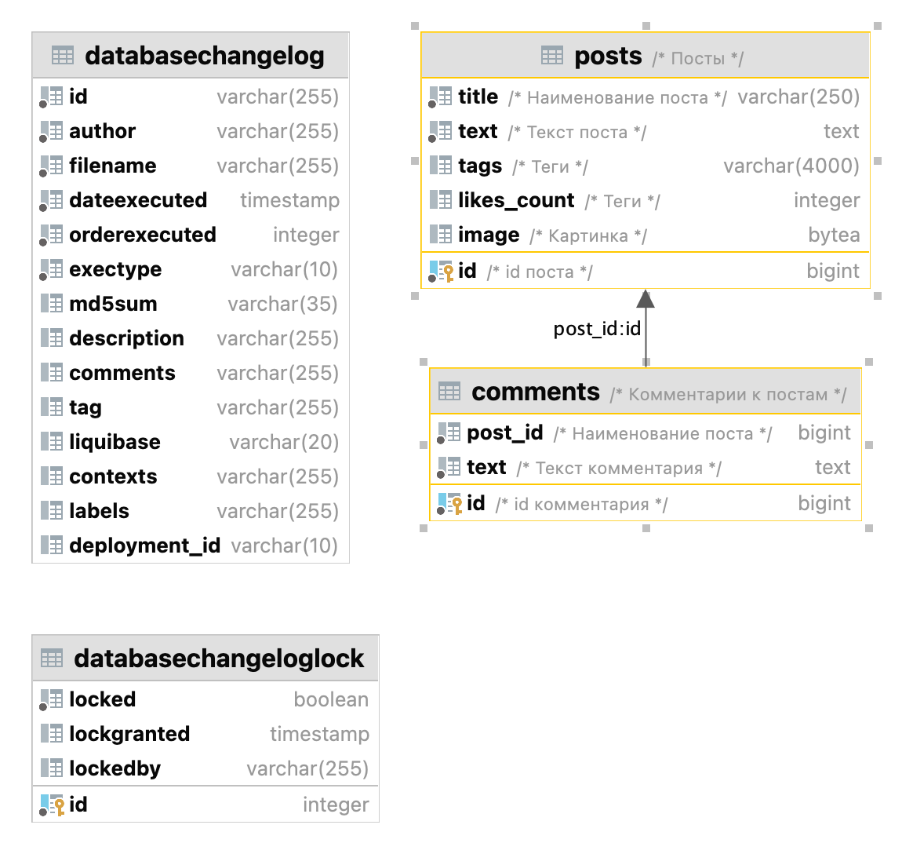

# myblog

Блог состоит из двух веб-страниц: 
* лента постов, 
* страница поста.

В ленте постов присутствуют:
* превью поста (название, картинка, коротко первый абзац не больше трёх строк);
* количество комментариев к посту;
* количество лайков к посту;
* теги поста;
* посты отображаются сверху вниз;
* фильтрация по тегу.

В ленте есть кнопка добавления поста, при нажатии на которую появляется форма добавления поста с возможностями:
* добавления названия поста;
* добавления картинки;
* написания текста;
* расстановки тегов.

При нажатии на название поста открывается страница поста, на которой присутствуют:
* название поста;
* картинка;
* текст поста, разбитый на абзацы;
* теги поста;
* кнопка удаления и редактирования поста;
* кнопка добавления комментария;
* кнопка лайков поста, при нажатии на которую счётчик лайков увеличивается на единицу;
* список комментариев;
* каждый комментарий содержит в себе текст комментария и возможность его редактирования/удаления.

При нажатии на комментарий его текст заменяется на поле текстового ввода, при нажатии на Ctrl+Enter комментарий сохраняется.

## _Структура проекта_

> Spring Framework 
> Java: 21 
> СУБД PostgreSQL: 17.5 

### ER diagram

